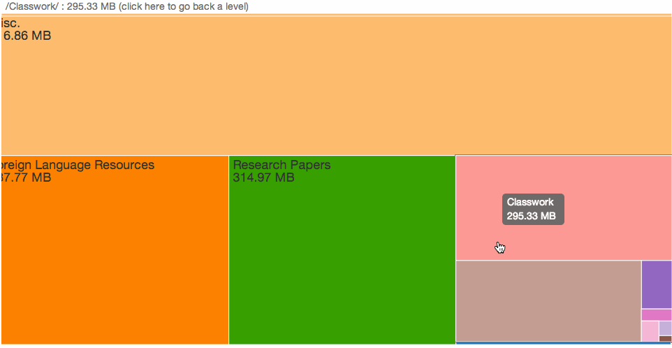

UtilityKnife
=========

UtilityKnife is a web application that visualizes a user's Dropbox space usage/allocation as a treemap. It is similar to desktop programs like Windirstat, KDirStat, Disk Inventory X, Grand Perspective, and Space Monger.

UtilityKnife was built in under 40 hours by Kevin Conley and Carolynn Sullivan at the PennApps Fall 2013 hackathon.

### Inspiration
UtilityKnife's visualization using the treemap from D3.js was heavily inspired by and built on Ben Garvey's Philadelphia budget visualization web application: http://budget.brettmandel.com/

### Getting started

#### Prerequisites
* Python 2.7
* pip
* virtualenv (`pip install virtualenv`)
* redis-server (`brew install redis`)
* foreman (`gem install foreman`)

#### Virtualenv
After cloning the repository, create a virtualenv called "venv" and activate it:
```
virtualenv venv
. venv/bin/activate
```

Then use the requirements.txt file to install the requirements for the app:
```
pip install -r requirements.txt
```

#### Environment Variables
There are several important environment variables that must be defined for the app to work. These are listed in "secrets.py", and it is helpful when working locally to define them in a file called ".env" that foreman will load automatically:

".env"
```
DROPBOX_APP_KEY=fill_me_in
DROPBOX_APP_SECRET=fill_me_in
DROPBOX_APP_REDIRECT="http[s]://your_server.com:port/dropbox-auth-finish"
FLASK_SECRET_KEY=fill_me_in
```

The `DROPBOX_APP_*` secrets come from the Settings page of your Dropbox app on [the Dropbox developer website](https://www.dropbox.com/developers). If you haven't already, you need to [create such a Dropbox app](https://www.dropbox.com/developers/apps/create). Make sure to set the permission type to "Full Dropbox" so UtilityKnife can analyze your entire Dropbox folder. You also need to add the relevant "Redirect URI" to your app's settings page to match the `DROPBOX_APP_REDIRECT` secret. For example, when I run the app locally on my computer I use `http://127.0.0.1:5000/dropbox-auth-finish`.

Likewise, it is important to define these environment variables for the production server if you will upload it to somewhere like Heroku.

#### Running the App
First, open a terminal and start the redis server:
```
redis-server
```

Then, open another terminal and start the app with:
```
foreman start
```

If all goes well, you should be able to access the app locally at `127.0.0.1:5000`.

### License
```
The MIT License (MIT)

Copyright (c) 2018 Kevin Conley

Permission is hereby granted, free of charge, to any person obtaining a copy of
this software and associated documentation files (the "Software"), to deal in
the Software without restriction, including without limitation the rights to
use, copy, modify, merge, publish, distribute, sublicense, and/or sell copies of
the Software, and to permit persons to whom the Software is furnished to do so,
subject to the following conditions:

The above copyright notice and this permission notice shall be included in all
copies or substantial portions of the Software.

THE SOFTWARE IS PROVIDED "AS IS", WITHOUT WARRANTY OF ANY KIND, EXPRESS OR
IMPLIED, INCLUDING BUT NOT LIMITED TO THE WARRANTIES OF MERCHANTABILITY, FITNESS
FOR A PARTICULAR PURPOSE AND NONINFRINGEMENT. IN NO EVENT SHALL THE AUTHORS OR
COPYRIGHT HOLDERS BE LIABLE FOR ANY CLAIM, DAMAGES OR OTHER LIABILITY, WHETHER
IN AN ACTION OF CONTRACT, TORT OR OTHERWISE, ARISING FROM, OUT OF OR IN
CONNECTION WITH THE SOFTWARE OR THE USE OR OTHER DEALINGS IN THE SOFTWARE.
```


